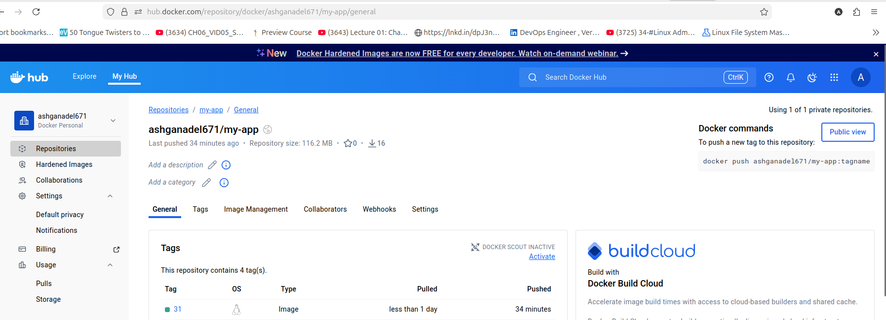

# CI/CD Pipeline for Java Application

This repository demonstrates a **complete CI/CD pipeline** for a Java-based application using **Ansible, Terraform, Jenkins, Maven, SonarQube, Argo CD, Docker, and Kubernetes**.  

The pipeline automates building, testing, code quality checks, Docker image creation, deployment to Kubernetes, and GitOps-based synchronization with Argo CD.

---

## **Technologies Used**

- **Java & Maven** – Build and package the application  
- **Jenkins** – Continuous Integration and Deployment orchestration  
- **SonarQube** – Static code analysis for code quality and security  
- **Docker** – Containerization of the application  
- **Kubernetes** – Deployment and orchestration  
- **Argo CD** – GitOps-based continuous deployment  
- **Ansible** – automate jave, maven, jenkins, and docker installation  
- **Terraform** – Infrastructure as Code (IaC) for provisioning infrastructure on AWS

---

    GitHub Repo (Code & K8s manifests)
              |
              v
           Jenkins
    (CI/CD pipeline triggers)
              |
    ------------------------
    |                      |
 Maven Build           SonarQube Scan
    |                      |

Docker Image Build & Push to Docker Hub
|
Update Kubernetes YAML (deployment.yml)
|
Commit & Push updated manifests
|
v
Argo CD
(Auto-syncs changes to Kubernetes cluster)

---

## **Pipeline Overview**

The pipeline includes the following stages:

1. **Checkout Code** – Pulls the latest code from GitHub  
2. **Build** – Compiles Java code using Maven, runs unit tests  
3. **SonarQube Analysis** – Performs code quality and security analysis  
4. **Docker Build** – Creates Docker image with the application  
5. **Push Docker Image** – Pushes image to Docker Hub  
6. **Update Deployment YAML** – Updates Kubernetes manifests with the new image tag  
7. **Push Changes to GitHub** – Updates GitOps repository for Argo CD  
8. **Deployment** – Argo CD automatically deploys the updated image to Kubernetes  

---

![SonarQube Quality Gate]  

